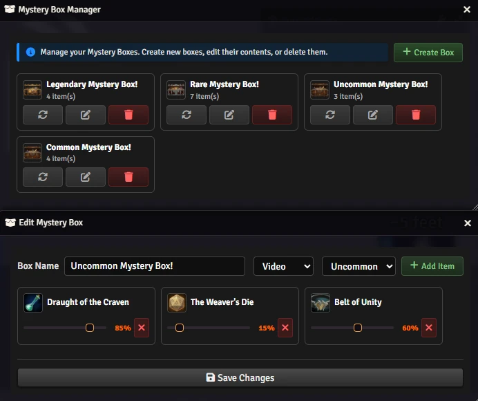
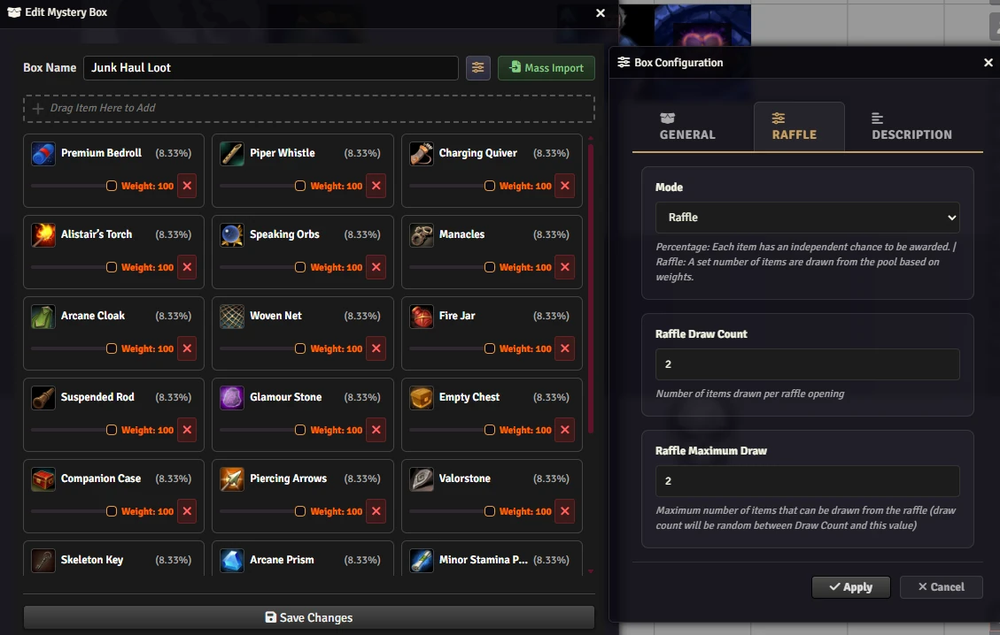
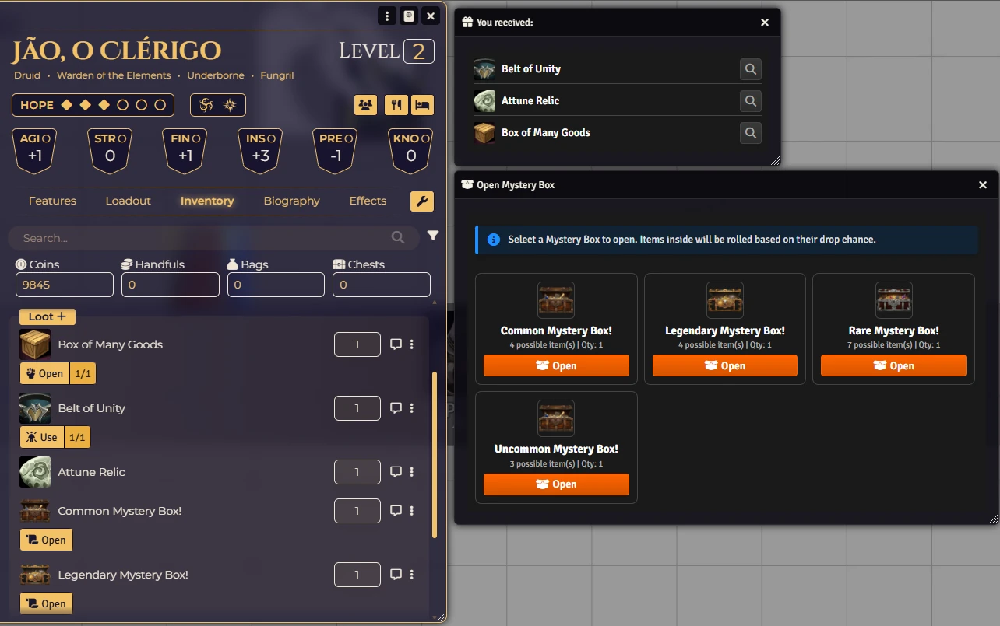
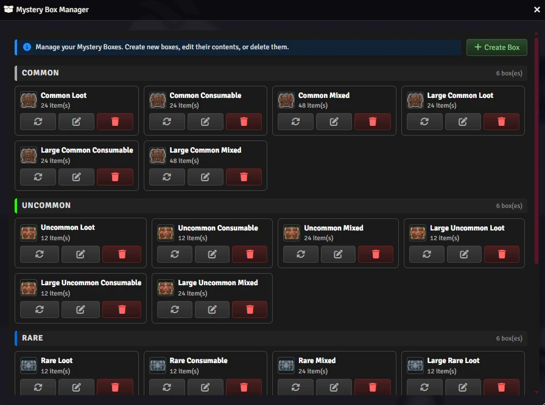

# 🎁 Mystery Box

## for Daggerheart

**Turn loot into an event!**

Add a thrill of surprise to your Daggerheart sessions. The **Mystery Box** module lets Game Masters create item boxes—like treasure chests, magical caches, or lucky bags—that players can open to reveal random rewards.

## ✨ Why use it?

*   **Suspense & Fun:** Players love the anticipation of rolling for loot.
*   **Visual Flair:** Opening a box triggers exciting animations (confetti or video) and sound effects.
*   **Automated Rewards:** No more manual copying of items. The module handles the dice rolls and drops the winnings directly into the character's inventory.
*   **Fully Customizable:** You decide what's in the box and the odds of getting it.

## ⚙️ How it works

1.  📦 **Create a Box:** As a GM, use the Mystery Box Manager to define a new box.
2.  ✨ **Fill it up:** Drag and drop items you want players to win and set their drop chances (e.g., 10% for a rare sword, 100% for a potion).
3.  🎁 **Give it to a Player:** Drag the box item to a player's character sheet.
4.  🎉 **Open & Enjoy:** The player clicks to open, watches the reveal, and collects their loot!

## Macros

```js
MysteryBox.Open();
```

```js
MysteryBox.Manager();
```

### Developers
[API](https://github.com/brunocalado/dh-mystery-box/wiki/API)

## 🎲 Box Modes

When creating a Mystery Box, you choose how it decides what the player receives. There are two modes:

### 🎯 Percentage Mode

Each item in the box has its **own independent chance** of being given to the player.

When the player opens the box, the module rolls a 1–100 dice **for each item separately**:
- If the roll is equal to or lower than the item's chance, the player **receives** that item.
- If not, that item is **skipped**.

This means the player can receive **multiple items at once**, **just one**, or even **nothing** — depending on how lucky the rolls are.

> **Example:** A box contains three items:
> - 🗡️ Rare Sword → 10% chance
> - 🧪 Healing Potion → 80% chance
> - 📜 Magic Scroll → 50% chance
>
> Each one is rolled independently. The player could walk away with all three, only the Potion, or nothing at all.

**Items set to 100% are always given** — no dice roll needed.

### 🎟️ Raffle Mode

The box draws a **fixed number of items** from the pool — like a raffle ticket. The player is **guaranteed to receive exactly N items** (or whatever range the GM configured).

Instead of each item fighting its own odds, all items compete against each other in a weighted draw:
- Items with **higher weights** are more likely to be picked.
- Items with **lower weights** are rarer picks.
- The same item **cannot be drawn twice** in a single opening.

A visible 1d100 dice is rolled first (its result seeds the random number generator), then the weighted draw happens behind the scenes.

> **Example:** A box has 5 items, all with different weights, and is set to draw **2 items**. The player will always get exactly 2, but which 2 depends on the weighted randomness.

**Use this mode when you want to guarantee a fixed number of rewards** but still want randomness in *which* rewards are given.

### 📊 Quick Comparison

| | Percentage | Raffle |
|---|---|---|
| Items received | 0 to all | Fixed count (N) |
| Each item rolled? | Yes, independently | No — all compete together |
| Can get nothing? | Yes | No (unless pool is empty) |
| Best for | Loot drops with variable results | Prize boxes with guaranteed rewards |

## 🎬 Opening Styles

When creating a Mystery Box, you can choose how the reveal is presented to the player.

### 🎉 Confetti
A burst of colorful confetti fills the screen. Lightweight and festive — works for any occasion.

### 🎥 Video
Plays a short animated video tied to the box's rarity before revealing the contents. The higher the rarity, the more dramatic the intro.

### 🔊 Sound Only
Plays the rarity sound effect without any visual animation. Good for a subtle reveal that doesn't interrupt the flow of play.

### 🚫 None
No animation or sound. The contents are revealed immediately and silently.

> **Tip:** Use **Video** for dramatic high-rarity rewards, **Confetti** for a fun everyday feel, **Sound Only** when you want atmosphere without distraction, and **None** for a fast no-frills experience.

## Export and Import Boxes 

You can share your created Mystery Boxes with other worlds. When you import a Mystery Box item into a world, the module automatically configures the necessary settings for you. You can also drag items directly from a compendium onto a player's character sheet.

## 🖼️ Images

The **Mystery Box Manager** is the GM's control panel. Here you create new boxes, name them, set their rarity, choose the opening style (Confetti, Video, Sound, or None), and select the box mode (Percentage or Raffle). Once configured, the box is ready to be filled with items.

<p align="center">
  
</p>

In **Raffle Mode**, items are listed with their relative **weights** instead of individual percentages. Items with higher weights are more likely to be drawn. The GM defines how many items the player is guaranteed to receive per opening — useful for prize boxes and structured rewards.

<p align="center">
  
</p>

The **Player View** shows what happens when a character opens a Mystery Box. The reveal animation plays (confetti burst or rarity video), followed by the list of items won. All rewards are automatically transferred to the character's inventory — no manual work required.

<p align="center">
  
</p>

The module ships with a collection of **ready-to-use Mystery Boxes**. These premade boxes cover a range of rarities and themes, so you can drop them straight into your session without any setup. They can also be used as templates for your own custom boxes.

<p align="center">
  
</p>

## 📥 Installation

Install via the Foundry VTT Module browser or use this manifest link:

```
https://raw.githubusercontent.com/brunocalado/dh-mystery-box/main/module.json
```

## ⚖️ Credits & License

* **Code License:** GNU GPLv3.

* **Assets:** AI images and videos provided are [CC0 1.0 Universal Public Domain](https://creativecommons.org/publicdomain/zero/1.0/).

* **empty.mp3, box-common.mp3, box-uncommon.mp3, box-rare.mp3, box-legendary.mp3:** [License](https://pixabay.com/service/license-summary/)

**Disclaimer:** This module is an independent creation and is not affiliated with Darrington Press.

# 🧰 My Daggerheart Modules

| Module | Description |
| :--- | :--- |
| 💀 [**Adversary Manager**](https://github.com/brunocalado/daggerheart-advmanager) | Scale adversaries instantly and build balanced encounters in Foundry VTT. |
| 💥 [**Critical**](https://github.com/brunocalado/daggerheart-critical) | Animated Critical. |
| 💠 [**Custom Stat Tracker**](https://github.com/brunocalado/dh-new-stat-tracker) | Add custom trackers to actors. |
| ☠️ [**Death Moves**](https://github.com/brunocalado/daggerheart-death-moves) | Enhances the Death Move moment with immersive audio and visual effects. |
| 📏 [**Distances**](https://github.com/brunocalado/daggerheart-distances) | Visualizes combat ranges with customizable rings and hover calculations. |
| 📦 [**Extra Content**](https://github.com/brunocalado/daggerheart-extra-content) | Homebrew for Daggerheart. |
| 🤖 [**Fear Macros**](https://github.com/brunocalado/daggerheart-fear-macros) | Automatically executes macros when the Fear resource is changed. |
| 😱 [**Fear Tracker**](https://github.com/brunocalado/daggerheart-fear-tracker) | Adds an animated slider bar with configurable fear tokens to the UI. |
| 🎁 [**Mystery Box**](https://github.com/brunocalado/dh-mystery-box) | Introduces mystery box mechanics for random loot and surprises. |
| ⚡ [**Quick Actions**](https://github.com/brunocalado/daggerheart-quickactions) | Quick access to common mechanics like Falling Damage, Downtime, etc. |
| 📜 [**Quick Rules**](https://github.com/brunocalado/daggerheart-quickrules) | Fast and accessible reference guide for the core rules. |
| 🎲 [**Stats**](https://github.com/brunocalado/daggerheart-stats) | Tracks dice rolls from GM and Players. |
| 🧠 [**Stats Toolbox**](https://github.com/brunocalado/dh-statblock-importer) | Import using a statblock. |
| 🛒 [**Store**](https://github.com/brunocalado/daggerheart-store) | A dynamic, interactive, and fully configurable store for Foundry VTT. |

# 🗺️ Adventures

| Adventure | Description |
| :--- | :--- |
| ✨ [**I Wish**](https://github.com/brunocalado/i-wish-daggerheart-adventure) | A wealthy merchant is cursed; one final expedition may be the only hope. |
| 💣 [**Suicide Squad**](https://github.com/brunocalado/suicide-squad-daggerheart-adventure) | Criminals forced to serve a ruthless master in a land on the brink of war. |